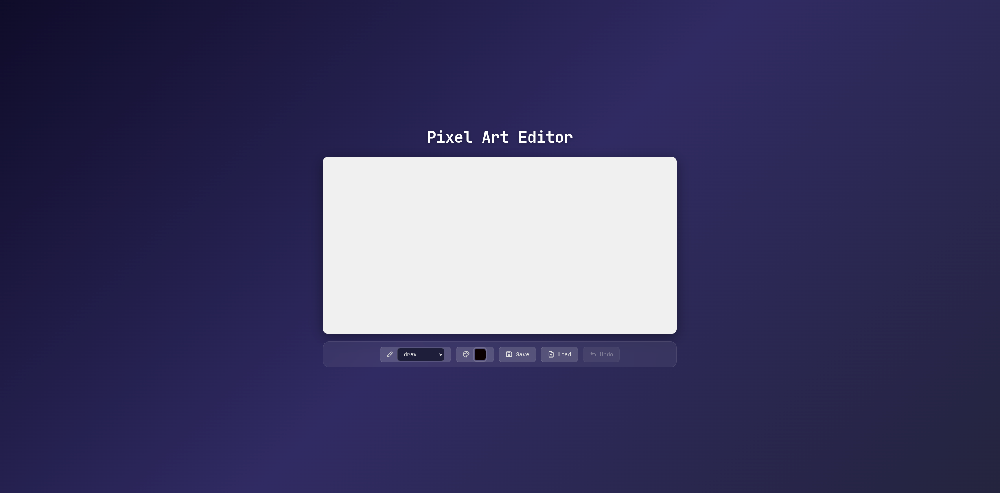
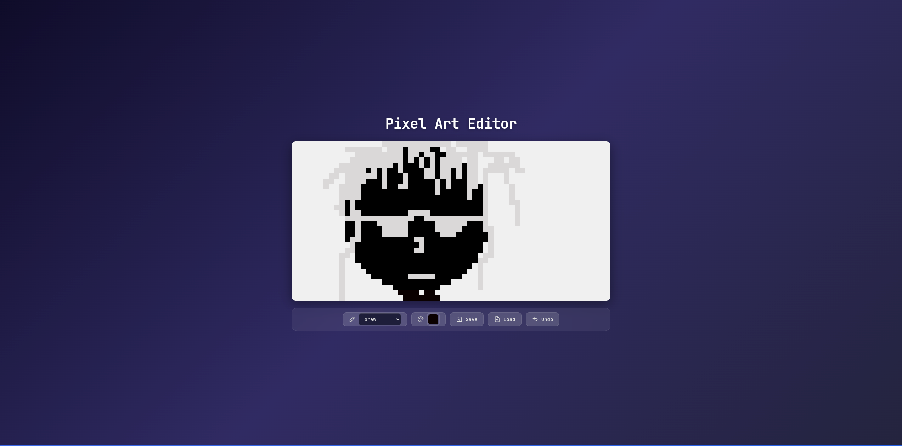

# Pixel Art Editor

Un editor de pixel art construido como ejercicio práctico del libro *Eloquent JavaScript* (capítulo 19 — "Project: A Pixel Art Editor").

Incluye herramientas de dibujo, selector de color, carga/exportación de imágenes y un sistema de deshacer.

## Capturas

## Herramientas

| Herramienta | Atajo | Descripción |
|---|---|---|
| **Draw** | `D` | Trazo libre, dibuja píxeles a medida que arrastras el mouse |
| **Line** | — | Línea recta entre dos puntos |
| **Fill** | `F` | Relleno por flooding (flood fill) |
| **Rectangle** | `R` | Rectángulo relleno desde una esquina a la opuesta |
| **Pick** | `P` | Cuentagotas: selecciona el color del píxel que tocas |
| **Circle** | — | Círculo relleno |

## Controles

- **Color picker** — selecciona el color activo
- **Save** — descarga el lienzo como PNG
- **Load** — importa una imagen desde el equipo
- **Undo** (`Ctrl+Z`) — deshace el último cambio

## Tecnologías

- HTML / CSS / JavaScript vanilla (sin dependencias ni build tools)
- [Tabler Icons](https://tabler.io/icons) para la iconografía
